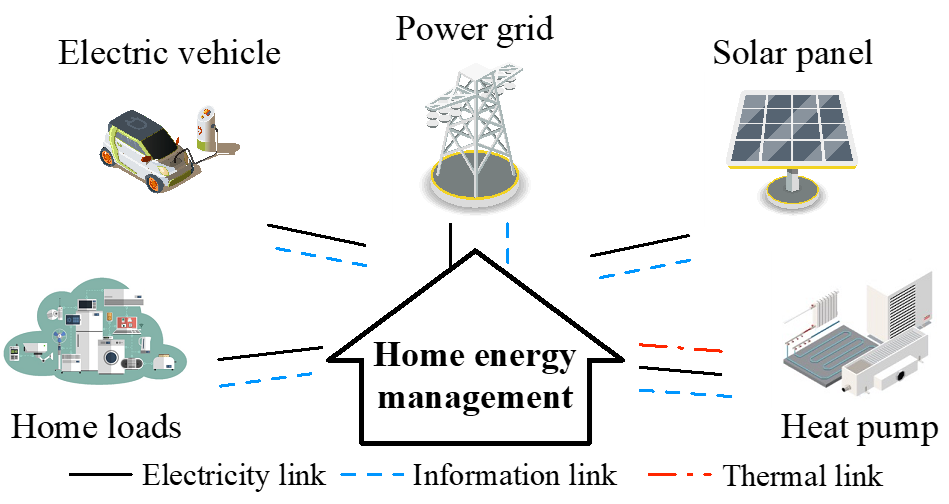

##  Ongoing Projects 

---------------
 
[//]: # (![MSCA.png]&#40;../images/MSCA.png&#41;)

* Integrating reinforcement learning and predictive control for smart home energy management, European Commission, Project ID: EC/HE/101110832
  * Chalmers University of Technology, Sweden

To achieve carbon neutrality and reduce dependence on fossil energy, solar panels, heat pumps and electric vehicles (EVs) are becoming commonplace in European homes. The abundant solar power, geothermal energy, as well as environmentally friendly electric vehicles, reduce the usage of fossil-based energy, while posing challenges to the home energy management system at the same time due to the intermittent feature of renewable energy and potential battery degradation from EVs. This Marie Skłodowska-Curie Postdoctoral Fellowship will propose a smart home management system to optimise the entire home energy cost while considering a set of constraints related to battery safety and reliability, driver/household demand, and actuator.

## Finished Projects

---

* Intelligent human-robot interface for assistive robots, A*Star & National Robotics Programme, Singapore
  * Rehabilitation Research Institute of Singapore, Nanyang Technological University, Singapore

